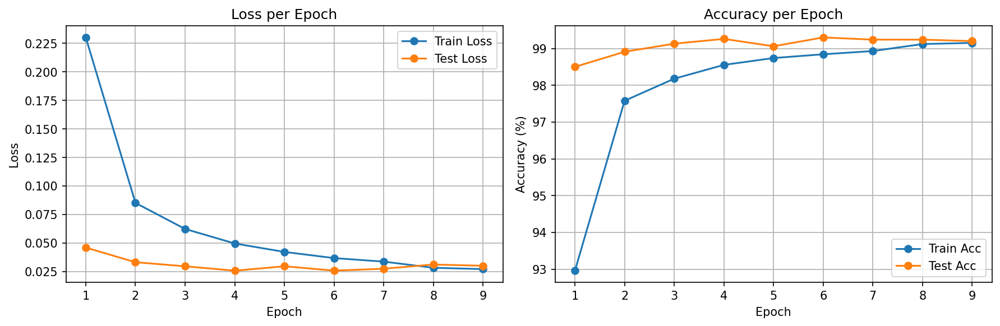
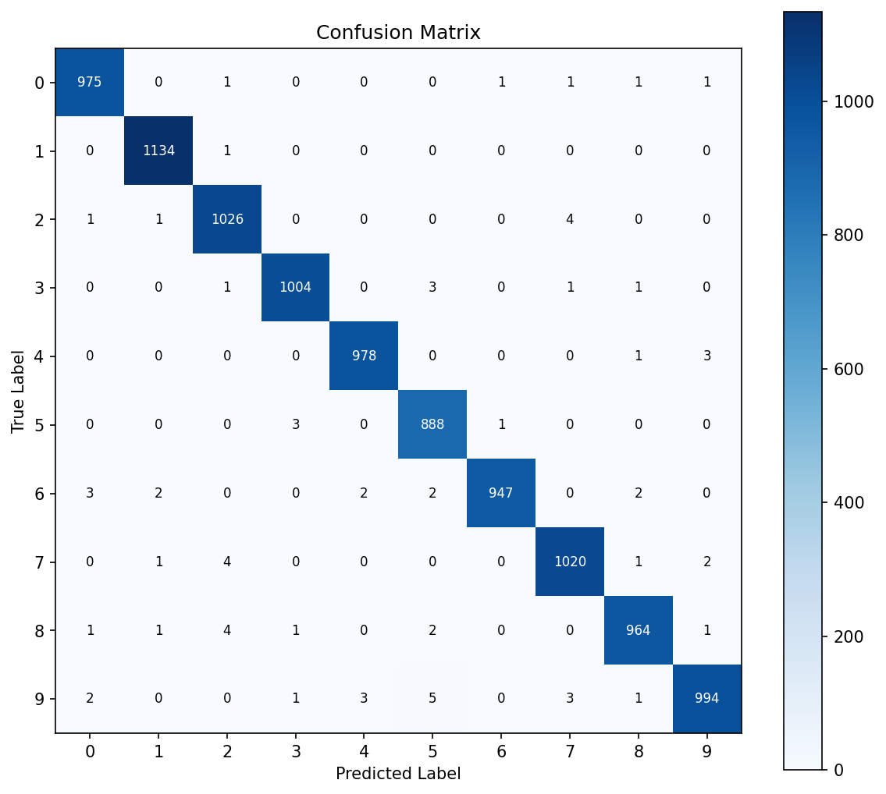
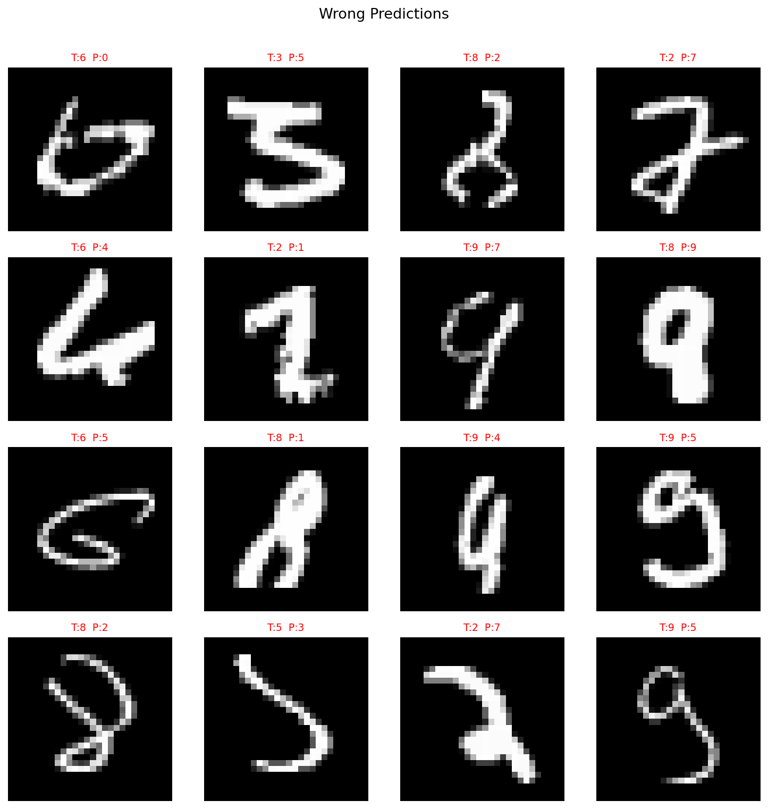

# 1. MNIST CNN Classifier

A from-scratch CNN implementation in **PyTorch** that classifies handwritten digits (0–9) from the MNIST dataset.  
Built as the first project in a progressive CNN learning series.

---

## Results

| Metric | Value |
|---|---|
| Best Test Accuracy | **99.35%** |
| Stopped at Epoch | 13 / 20 (Early Stopping) |
| Final Train Accuracy | 99.31% |

### Loss & Accuracy Curves


### Confusion Matrix


### Wrong Predictions Gallery


---

## Model Architecture

```
Input (N, 1, 28, 28)
    │
    ▼
Conv2d(1→32, k=3, pad=1) → ReLU → MaxPool2d(2)   # (N, 32, 14, 14)
    │
    ▼
Conv2d(32→64, k=3, pad=1) → ReLU → MaxPool2d(2)  # (N, 64, 7, 7)
    │
    ▼
Flatten → Linear(3136→128) → ReLU → Dropout(0.5)
    │
    ▼
Linear(128→10)   ← raw logits for 10 digit classes
```

---

## Design Decisions & Experiments

### Why this architecture?
- **2 Conv layers**: MNIST is simple enough that 2 layers capture sufficient features (edges → curves → digit shapes).  
  Adding more layers did not improve accuracy meaningfully.
- **MaxPool after each Conv**: Halves spatial dimensions, reduces computation, adds translation invariance.
- **Dropout(0.5)**: Prevents overfitting on the FC layer. Without it, Train Acc reaches ~99.5% while Test Acc plateaus earlier.

### Why Adam over SGD?
Adam adapts the learning rate per parameter and converges faster on this task.  
Experiment: SGD (lr=0.01, momentum=0.9) reached ~99% but required more epochs.

### Early Stopping
Patience = 3 epochs. Training stopped at epoch 13, saving the best checkpoint at epoch 10 (99.34% test acc).  
Without early stopping, Test Acc started to slightly decline after epoch 10 while Train Acc kept rising — classic overfitting signal.

### padding=1 with kernel_size=3
Using the formula: `output = (input - kernel + 2*padding) / stride + 1`  
→ `(28 - 3 + 2×1) / 1 + 1 = 28` → spatial size preserved through Conv layers.

---

## What I Learned

- How Conv → ReLU → MaxPool changes tensor shape at each step
- The difference between `model.train()` and `model.eval()` (Dropout behaviour)
- Why `optimizer.zero_grad()` is needed every batch
- How Early Stopping + `torch.save` / `torch.load` preserves the best checkpoint
- How to diagnose model weaknesses using a Confusion Matrix and wrong-prediction gallery

---

## Key Observations from Confusion Matrix

The model most frequently confuses:
- **4 → 9** and **9 → 4** (similar loop shapes)
- **3 → 5** (similar curve structure)

These are the hardest cases for any MNIST model and reflect real visual ambiguity.

---

## Project Structure

```
1_MNIST_CNN/
├── notebooks/
│   ├── 01_mnist_cnn_train.ipynb      ← full training walkthrough
│   └── 02_results_visualization.ipynb ← loss curves, confusion matrix, wrong preds
├── scripts/
│   ├── model.py                       ← SimpleCNN definition
│   ├── train.py                       ← end-to-end training script
│   └── utils.py                       ← train/evaluate + all visualization helpers
├── results/                           ← saved .pth checkpoint + .png plots
├── data/                              ← MNIST downloaded here (gitignored)
└── README.md
```

---

## How to Run

```bash
# From the 1_MNIST_CNN/ directory
python scripts/train.py            # fresh training (random init)
python scripts/train.py --resume   # continue from best_model.pth
```

- **Default**: Random initialization → train from scratch
- **`--resume`**: Load previous checkpoint and continue training

After training, the following are saved to `results/`:
- `best_model.pth` — best checkpoint
- `loss_acc_curves.png` — loss/accuracy curves
- `confusion_matrix.png` — confusion matrix
- `wrong_predictions.png` — wrong prediction gallery

Or open `notebooks/CNN-MNIST-pytorch.ipynb` in Google Colab and run all cells.

---

## Environment

- Python 3.x
- PyTorch 2.x
- torchvision
- matplotlib, numpy
