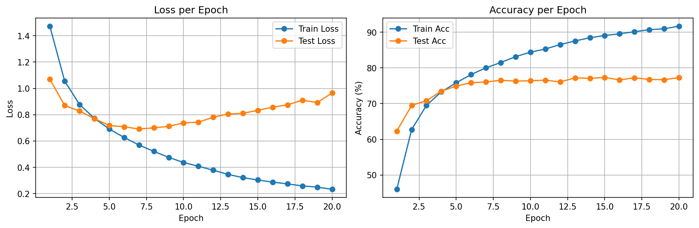
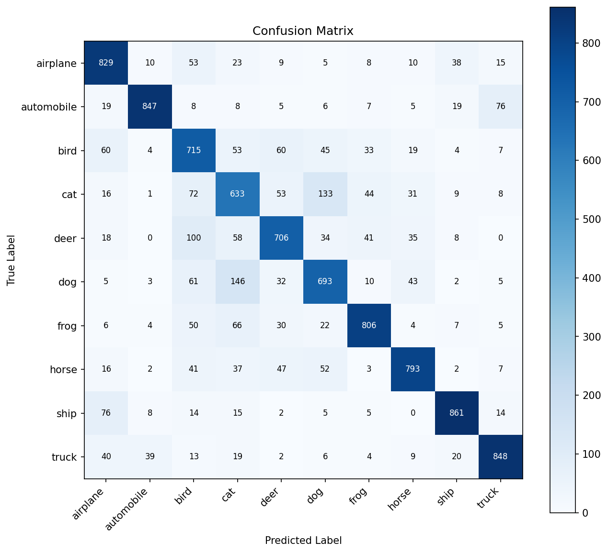
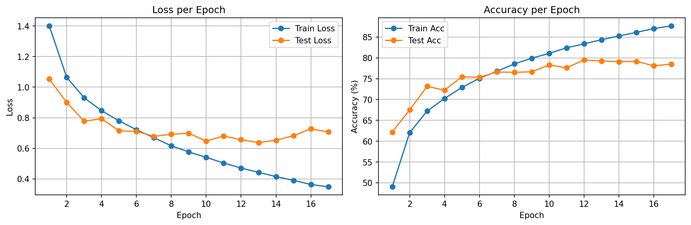
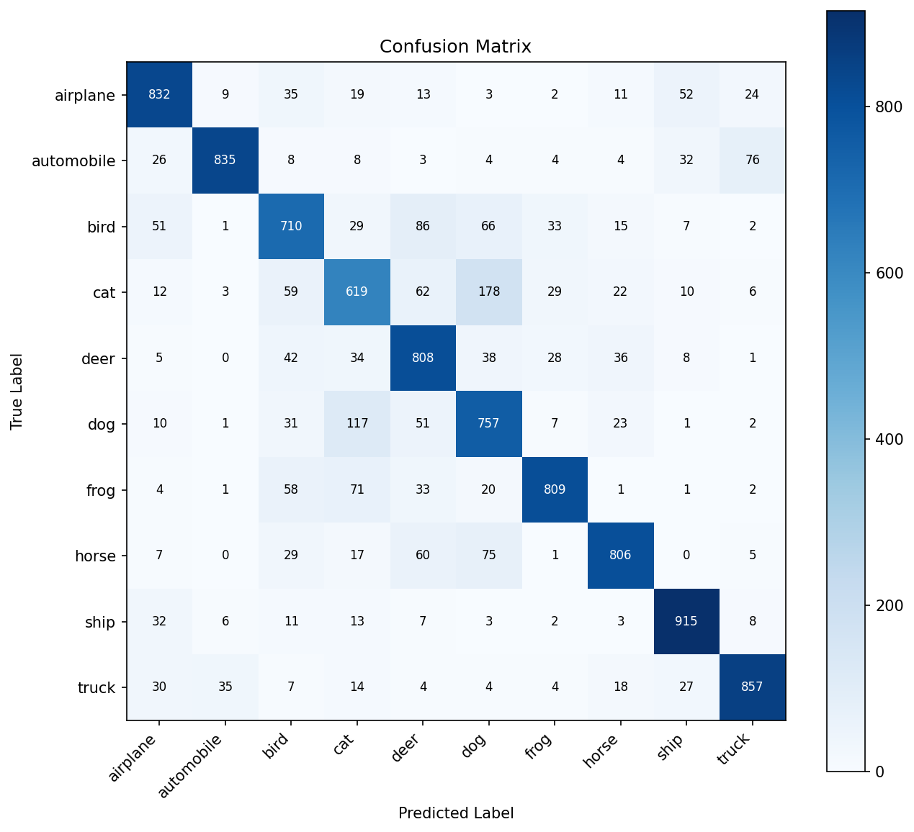

# 2. CIFAR-10 CNN Classifier

A progressive CNN experiment on **CIFAR-10** (32x32 color images, 10 classes), exploring the impact of **Batch Normalization** and **LR Scheduling** on a from-scratch architecture.

---

## Experiment Summary

| Version | Description | Best Test Acc | Epochs | Key Change |
|---------|------------|---------------|--------|------------|
| v1 | Baseline CNN | **77.31%** | 20 (no early stop) | — |
| v2 | + BatchNorm | **79.48%** | 17 (early stop) | BatchNorm after each Conv |
| v3 | + LR Scheduler | — | — | ReduceLROnPlateau |

---

## Model Architecture

### v1 — Baseline (`CIFAR10_CNN`)

```
Input (N, 3, 32, 32)
    │
    ▼
Conv2d(3→32, k=3, pad=1) → ReLU → MaxPool2d(2)    # (N, 32, 16, 16)
    │
    ▼
Conv2d(32→64, k=3, pad=1) → ReLU → MaxPool2d(2)   # (N, 64, 8, 8)
    │
    ▼
Conv2d(64→128, k=3, pad=1) → ReLU → MaxPool2d(2)  # (N, 128, 4, 4)
    │
    ▼
Flatten → Linear(2048→256) → ReLU → Dropout(0.5)
    │
    ▼
Linear(256→10)   ← raw logits for 10 classes
```

### v2 — BatchNorm (`CIFAR10_CNN_BN`)

Same architecture, but each conv block becomes **Conv → BN → ReLU → Pool**.

### v3 — LR Scheduler

Same model as v2, with `ReduceLROnPlateau(mode='max', factor=0.5, patience=3)` added to adaptively halve the learning rate when test accuracy plateaus.

---

## Results

### v1 — Baseline

| Metric | Value |
|--------|-------|
| Best Test Accuracy | **77.31%** |
| Stopped at Epoch | 20 / 20 |
| Overfitting Gap | ~15% (Train 92% vs Test 77%) |




### v2 — BatchNorm

| Metric | Value |
|--------|-------|
| Best Test Accuracy | **79.48%** (+2.17%) |
| Stopped at Epoch | 17 / 20 (Early Stopping) |
| Overfitting Gap | ~8% (Train 87% vs Test 79%) |




### v3 — LR Scheduler

> Not yet trained. Run `python scripts/train_v3_scheduler.py` to generate results.

---

## Key Observations

### Why 3 Conv layers instead of 2?
CIFAR-10 images are 32x32 RGB — more complex than MNIST's 28x28 grayscale. A third conv layer captures higher-level features (textures, object parts) needed to distinguish visually similar classes like cat vs dog.

### BatchNorm Effect (v1 → v2)
- **+2.17% test accuracy** (77.31% → 79.48%)
- **Overfitting reduced**: the train-test gap shrank from ~15% to ~8%
- **Faster convergence**: BN stabilizes internal activations, allowing the model to learn more efficiently
- **Earlier stopping**: early stopping triggered at epoch 17 (v1 ran all 20 epochs)

### Most Confused Classes
Both v1 and v2 consistently struggle with:
- **cat ↔ dog** (similar body shapes, textures)
- **cat → dog**: 133 (v1), 178 (v2)
- **dog → cat**: 146 (v1), 117 (v2)
- **bird ↔ deer** (overlapping background contexts)

These reflect real visual ambiguity in CIFAR-10's low-resolution 32x32 images.

---

## Project Structure

```
2_CIFAR10_CNN/
├── scripts/
│   ├── model.py              ← CIFAR10_CNN + CIFAR10_CNN_BN definitions
│   ├── utils.py              ← shared: get_device, train, evaluate, plot helpers
│   ├── train.py              ← v1 baseline training
│   ├── train_v2_BN.py        ← v2 BatchNorm training
│   └── train_v3_scheduler.py ← v3 LR Scheduler training
├── results/
│   ├── v1/                   ← v1 checkpoint + plots
│   ├── v2_BN/                ← v2 checkpoint + plots
│   └── v3_scheduler/         ← v3 checkpoint + plots (after training)
├── data/                     ← CIFAR-10 downloaded here (gitignored)
└── README.md
```

---

## How to Run

```bash
# From the 2_CIFAR10_CNN/ directory
python scripts/train.py              # v1: baseline (fresh)
python scripts/train_v2_BN.py        # v2: + BatchNorm (fresh)
python scripts/train_v3_scheduler.py # v3: + LR Scheduler (fresh)

# Resume from a previous checkpoint
python scripts/train_v3_scheduler.py --resume-from results/v2_BN/best_model.pth
```

- **Default**: fresh training from random initialization
- **`--resume-from`**: load a `.pth` checkpoint and continue training (architecture must match)

Each script saves to its own `results/<version>/` folder:
- `best_model.pth` — best checkpoint
- `loss_acc_curves.png` — loss/accuracy curves
- `confusion_matrix.png` — confusion matrix
- `wrong_predictions.png` — wrong prediction gallery

---

## Environment

- Python 3.x
- PyTorch 2.x
- torchvision
- matplotlib, numpy
